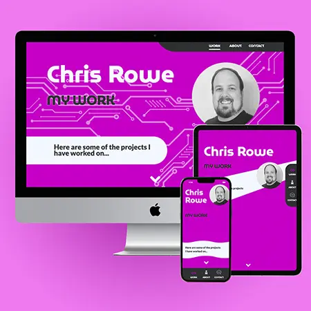

# Chris Rowe Portfolio Site  

## Description  
A Nuxt3 Portfolio website to deomnstrate front end development skills.  

* Motivation  
This project serves to demonstrate my front end development skills as of August 2022. It utilizes a mix of modern technologies and practices for design, responsiveness, accessibility, and performance.  

* Reason for Building  
I built the product for self promotion, but also left the repo for the work public and open source so other junior developers may see the techniques I'm using.  

* Problems Solved  
It provides a unified resource for demonstrating my development skills.  

* Things Learned  
I learned ao muchdoing this project. I implimented generating reusable componrnts. Structuring my markup with semantic HTML elements as they will be viewed by a screen reader using the Chrom DevTools accesibility tree. I learned to utilize next generation web image formats for performant page loading (.webp) from WebPageTest tooling. I learned I could write my own animations from scratch in CSS by understanding the nature of a transform. This project taught me how to bundle system fonts to utilize and specify whern I wanted to use alternate characters in the final output. The project was my first utilization in sequential element animations using delay timing. I implimented lazy loading for off screen assets for the first time. And it was my first time doing a full ground-up UI/UX design for 3 layouts on each page and then coding to match the Figma for pixel perfect execution.  

## Table of Contents  
* [Installation](#installation)  
* [Usage](#usage)  
* [Updating](#updating)
* [License](#license)  
* [Contributing](#contributing)  
* [Tests](#tests)  
* [Questions](#questions)  
## Installation  
This application is meant to be experienced through the web browser at the live deployment url https://rowe2ry.com but you can access the repo on GH and clone it down to play with any of the tooling used.
## Usage    
There is a simple 3 link navigation interface. Other than that the site is mostly meant to be experienced by reading. The desktop layout supports various hover effects for learning asbout the technologies used. The work page does have some external links to project repos as well.  
## Updating
This project utilizes reusable components which populate on each page in the "InfoCard" component list through a loop iteration. The source metadata form each page is kept in a JSON file for each page found in the root/static/data directory. Look at the InfoCard.vue file for comments describing which type of reusable components can be called in, and use the existing JSON files in the data directory to determin the pattern schema for displaying information. At least one example of eavy componenty type which utilizes all of the applicable jky/value pairs is present in the project. Due to the small scope of the project and generous comenting, it can serve as a pretty streamlined example of its own functionality by studying the code itself. If there are any questions about any code structure, or suggestions for improvemewnt, please reach out to me via one of the various contact methods listed on the contact page of this project.
## License  
[MIT](https://opensource.org/licenses/MIT)  
## Contributing  
Every single asset on this page was developed and implimented by me,. However the tooling created by the developer community and the NUXT/Vue core team as well as the talented team that built Figma, Tasilwind, and VSCode all made this project possible. I also would like to list a few names of various devs, project managers, UX designers, friends, and family that mentored and supported me through this build. Richard Tuttle, Ola Onikosi, Josh Wolf, Junghoon Yoon, Mark Noonan, Andrew Ausley, Michael Meeks, Merry Rowe, Logan Rowe, Richard Maseman  
## Tests  
Resize the browser window while browsing and see if the design stays legible and tidy. Run the application through performance metric tools such as GHoogle's lighthouse or WebPageTest.  
## Questions  
Reach out if you have any questions about this project.
